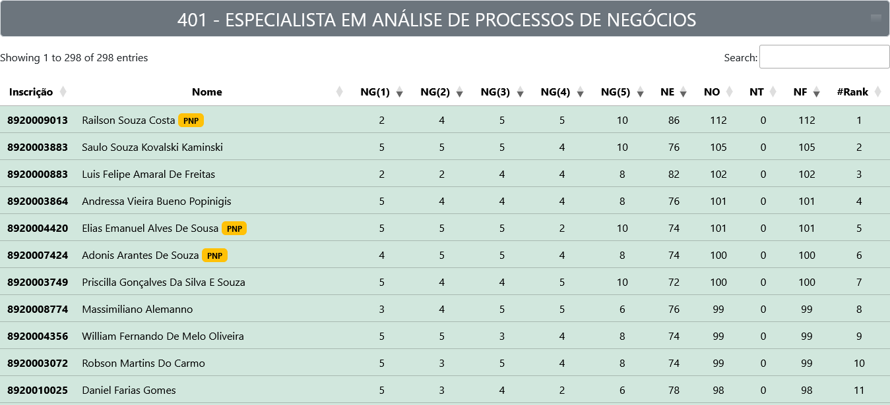

<p align="center">


</p>

<h1 align="center">Ranking - PSS/MGI/2024 (AOCP)  <br>  (<a href="https://eeass.github.io/pssmgi24/rank/" target="_blank">https://eeass.github.io/pssmgi24/rank/</a>)</h1>




<h2 align="center"></h2>

### Conversas / MeetUp

* Grupo de Candidatos no Telegram: [t.me/processoSeletivoSimplificadoMGI](https://t.me/processoSeletivoSimplificadoMGI)

### Colaborações

* Calculadora de Nota: [https://eeass.github.io/pssmgi24/calc/](https://eeass.github.io/pssmgi24/calc/)
* Ranking "Preliminar": [https://eeass.github.io/pssmgi24/rank/](https://eeass.github.io/pssmgi24/rank/)


### Esquema dos Dados (JSON)

A página we foi desenvolvida para exibir os dados extraídos de arquivos JSON, separados e criados a partir do escopo de cada cargo, mas com  o mesmo "esquema de dados" representados abaixo:

```
{
  "vagas": 
    {
        "ampla":22, // Numeric (Int) Type
        "pcd":2, // Numeric (Int) Type
        "pnp":6 // Numeric (Int) Type
    },
  "candidatos": 
    {
        "8920000135": // String  Type
        {
        "name": "Fulano de Tal", // String  Type
        "nota_gerais": [
            4, // Numeric (Int)
            2, // Numeric (Int)
            3, // Numeric (Int)
            4, // Numeric (Int)
            6  // Numeric (Int)
        ], // Array Type
        "nota_especifica": 58, // Numeric (Int) Type
        "nota_objetiva": 77, // Numeric (Int) Type
        "titulos": true, //Boolean Type
        "nota_titulos": 0, // Numeric (Int) Type
        "cota_pnp": false, //Boolean Type
        "cota_pcd": false //Boolean Type
        }
    }
}
```
Cada arquivo têm apenas 2x nós (node) de "topo/root", sendo o principal o nó "candidatos" onde são armazenados os dados de cada "candidato" a ser exibido no rank, representando as informações de linha da tabela. Portanto, a quantidade nós (filhos) dentro do nó (pai) "candidatos" foi definir quantos candidatos e linhas serão exibidas em cada carregamento rank/tabela.

```
{
  "vagas": {}, // Object Type
  "candidatos": {} // Object Type
}
```
O nó pai "vagas" funciona como metadado do cargo (escopo) apenas para permitir o destaque dos candidados "ranqueados" dentro do número de vagas previstas no edital.

```
    {
        "8920000135": // String  Type
        {
        "name": "Fulano de Tal", // String  Type
        "nota_gerais": [
            4, // Numeric (Int)
            2, // Numeric (Int)
            3, // Numeric (Int)
            4, // Numeric (Int)
            6  // Numeric (Int)
        ], // Array Type
        "nota_especifica": 58, // Numeric (Int) Type
        "nota_objetiva": 77, // Numeric (Int) Type
        "titulos": true, //Boolean Type
        "nota_titulos": 0, // Numeric (Int) Type
        "cota_pnp": false, //Boolean Type
        "cota_pcd": false //Boolean Type
        }
    }
```


Os nós (filhos) de "candidatos" possuem os dados relevantes de cada candidato para o ranqueamento. Seu esquema de dados é baseado nas tabelas do "Resultado Preliminar" da Prova Objetiva, posteriormente apenas "ratificado" (não republicado) como "Resultado Definitivo". Essa estrutura foi escolhida pois contém a composição (desestruturação por disciplina) da nota final da "Prova Objetiva", necessária a aplicação dos critérios de DESEMPATE previstos no item 14.3 do Edital (com exceção do critérios "a" e "i" relacionados a IDADE/NASCIMENTO dos candidatos, ainda não disponibilizados publicamente).

 


Portanto, seguindo a ordem dos fatores de cada critérios foram aplicados filtros de ordenamento decrescentes nas respectivas colunas para o tratamento dos casos de desempate e o ranqueamento mais fidedigno posível.

```
"nota_gerais": [
            4, // Numeric (Int)
            2, // Numeric (Int)
            3, // Numeric (Int)
            4, // Numeric (Int)
            6  // Numeric (Int)
        ], // Array Type
```


O array de notas da "Prova Objetiva" é manipulado e tratado durante o carregamento do dados, de forma popular as colunas específicas da tabela.

```
        "titulos": true, //Boolean Type
        "cota_pnp": false, //Boolean Type
        "cota_pcd": false //Boolean Type
```
O esquema possui dados booleanos que não correspondem diretamente a colunas exibidas na tabela, mas são utilizados pra filtrar a base origem para ocultar os candidatos não "convocados" para fase de títulos (eliminados) e, por outro lado, marcar (badges) os candidatos que concorrem pelos sistemas de cotas. Isso permite filtrar dinaminamente esses casos utilizado o campo de pesquisa (search) da tabela e reconstruir o rank de posições e cortes de vagas (quando presentes os metadados do cargo).


### Carregamento / Tratamento / Exibição

Uma vez que o "esquema de dados" acima foi executado corretamente, bastará armazenar o arquivo de dados do cargo (escopo) na pasta `rank/data/` e inseri-lo do arquivo de mapeamento `rank/data/map.json` na mesma pasta para os dados serem automaticamente carregados e preparados para exibição pelo `script` presente na página inicial `rank/index.html`.

Depois de tratados, todo o serviço pesado de exibição e filtragem dos dados é feito pela biblioteca [DataTables](https://datatables.net/), incorporada/integrada a página.

Desta forma, a disponibilidades de "cargos" para consulta no rank (através do menu `select` no topo da página), depende diretamente da existência do arquivo de dados do "cargo" na pasta `rank/data/`


 


